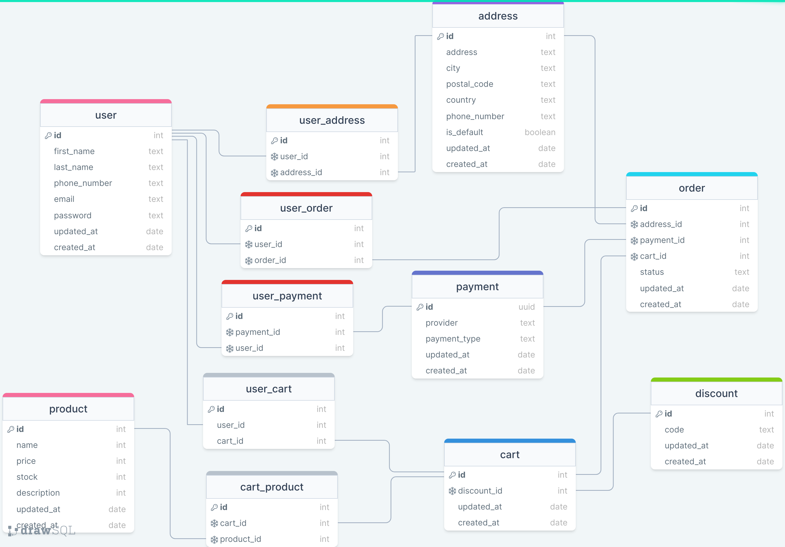

# e-commerce-server

GET /api/products  
[x] Pagination  
[x] Show number of items per page  
[x] Sorting by price (asc / desc)  
[x] Sorting by date (asc / desc)  
[x] Sorting by name (asc / desc)

GET /api/products/slug
[x] returning details of the single product

POST /api/products
[x] adding new product

DELETE /api/products/:productId
[x] remove the product

PUT /api/products/:productId
[x] update product details
